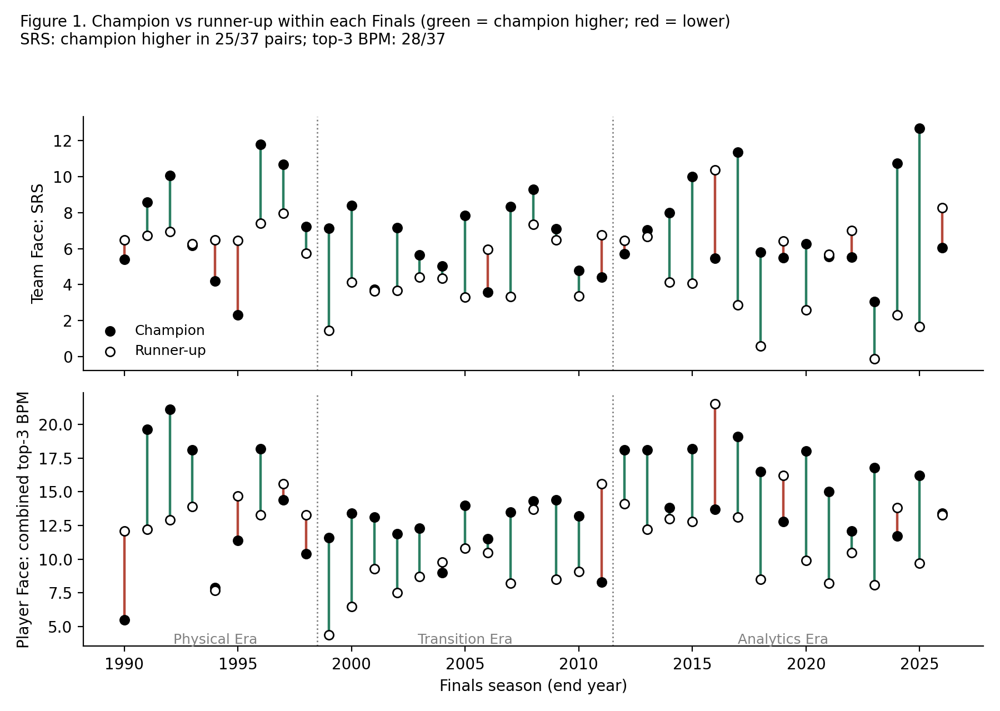

# The Championship Cube

**A six-face diagnostic framework for evaluating NBA championship contention** — Team, Player, Coach, Front Office, Controllable External and Uncontrollable External Faces — applied to 37 matched champion / Finals runner-up pairs (74 team-seasons, 1989-90 to 2025-26).

This repository accompanies the abstract *"The Championship Cube: A Six-Face Diagnostic Framework for Evaluating NBA Championship Contention"*, submitted to the MIT Sloan Sports Analytics Conference (SSAC) 2027. (The repository name keeps the paper's earlier working title.) It contains the data, the analysis code that reproduces every number in the abstract, a pilot of the qualitative rubric, and **KIRIN**, a prototype self-assessment tool.

> **Status in one paragraph.** Team Face (SRS) and Player Face (combined top-3 BPM) each separate champions from runners-up in a matched-pair analysis, and the signal holds in leave-one-pair-out and temporal hold-out checks (with the caveat that the predictors were chosen using all 37 pairs, so these are not fully independent validation). Coach Face and two coarse Front Office proxies show no statistically significant separation (payroll relative to the cap favoured the champion in 23/37 pairs, but p = 0.33). The three organisational faces are **not** validated: a 10-pair pilot, coded by one coder, showed scores clustering at the top of the rubric and no measurable separation, and inter-rater reliability was not assessed. The Cube is presented as a structured diagnostic, not a validated predictor.

## Headline results

All figures are produced by `Championship-Cube-Paired-Analysis.py` and written to [`Paired-Analysis-Results.md`](Paired-Analysis-Results.md).

| Face | Measure | OR per unit (95% model-based CI) | Franchise-clustered OR interval | p (conditional logit) | Pairs favouring champion |
|---|---|---|---|---|---|
| Team | SRS | 1.37 (1.08-1.75) | 1.05-2.08 | 0.011 | 25/37 (67.6%) |
| Player | Combined top-3 BPM | 1.26 (1.07-1.48) | 1.03-1.63 | 0.005 | 28/37 (75.7%) |
| Coach | Wins − Pythagorean wins | — | — | 0.65 (paired t-test) | 18/37 (48.6%) |
| Front Office proxy | Payroll / salary cap | — | — | 0.33 (Wilcoxon) | 23/37 (62.2%) |
| Front Office proxy | Draft hit rate | — | — | 0.98 (Wilcoxon) | 16/37 (43.2%) |

"Pairs favouring champion" uses the parameter-free rule *the champion has the higher value*; ties are not counted as favouring the champion (5 tied pairs for Coach Face, 8 for draft hit rate).

Other results:

- **SRS vs BPM:** the two did not differ significantly in classification (exact McNemar p = 0.55); their within-pair differences correlate at r = 0.55.
- **Out-of-sample checks, two-predictor model (SRS + top-3 BPM):** 26/37 pairs correct under leave-one-pair-out validation; 11/15 (73%, exact 95% CI 45-92%) in 2012-2026 when trained only on the 22 pre-2012 pairs. On those same 15 later pairs, the single-predictor "higher wins" rules got 9/15 (SRS) and 12/15 (BPM), so the combined model is not shown to beat BPM alone.
- **Eras:** the SRS gap is descriptively larger in the Analytics Era (2.65) than the Physical Era (0.67), but era differences are not significant (ANOVA p = 0.43).
- **Post hoc, exploratory:** SRS below 5 occurred in 7 of 37 champions vs 17 of 37 runners-up; top-3 BPM below 10 in 4 vs 15. These thresholds were chosen after seeing the data.



## Reproduce the results

```bash
git clone https://github.com/ChampionshipCube-Sloan2027/The-Championship-Cube-A-Front-Office-Framework-for-Building-NBA-Champions
cd The-Championship-Cube-A-Front-Office-Framework-for-Building-NBA-Champions
python -m venv .venv && source .venv/bin/activate     # optional but recommended
pip install -r requirements.txt
python Championship-Cube-Paired-Analysis.py           # writes Paired-Analysis-Results.md
python Championship-Cube-Figure1.py                   # writes Figure1_paired_finals.png
python kirin_prototype.py                             # runs both smoke tests
```

The scripts read the three CSVs from `./Data/` if that folder exists, otherwise from the repository root. Bootstrap steps use fixed seeds, so reruns give the same numbers.

Expected output of `python kirin_prototype.py` (outside a notebook):

```
Validation smoke test passed: SRS and BPM regressions match published statistics; Coach Face remains a null result
KIRIN smoke test passed
Guided UI skipped (needs ipywidgets/IPython; run launch_guided_ui() from a notebook).
```

## Repository contents

```
.
├── README.md
├── CHANGELOG.md
├── LICENSE
├── CITATION.cff
├── requirements.txt
├── The Championship Cube SSAC2027 Abstract.pdf         # the submitted abstract
│
├── Championship-Cube-Master-Dataset(Winner).csv        # 37 champion team-seasons
├── Championship-Cube-Master-Dataset(Lossers).csv       # 37 runner-up team-seasons (filename typo kept so code paths stay stable)
├── Championship-Cube-Coach-Face.csv                    # Coach Face scores, both groups (two stacked tables, repeated header rows)
│
├── Championship-Cube-Paired-Analysis.py                # matched-pair analysis: every number in the abstract
├── Paired-Analysis-Results.md                          # its auto-generated output
├── Championship-Cube-Figure1.py                        # regenerates Figure 1
├── Figure1_paired_finals.png
├── Championship-Cube-Era-Analysis.py                   # earlier pooled era/trend analysis (kept for transparency; not the source of the abstract's numbers)
│
├── kirin_prototype.py                                  # KIRIN diagnostic tool + smoke tests
├── Championship-Cube-Qualitative-Coding-Audit-README.csv  # rubric scaffold for the full qualitative audit
│
├── Pilot-Coding-Sheet_PRIMARY-FINAL.xlsx               # pilot: the single coder's completed sheet (20 team-seasons, randomised order)
├── pilot_answer_key.csv                                # pilot: maps row IDs to pair and champion / runner-up
└── pilot_analysis.py                                   # pilot: agreement + paired-difference script (needs two coders' sheets)
```

## Data and provenance

- Team, player and coach statistics come from [Basketball-Reference](https://www.basketball-reference.com/). SRS, ORtg, DRtg, Pace, Net Rating, payroll and salary-cap figures are as published there. Please consult Basketball-Reference's terms of use before reusing the source data beyond replication of this study.
- **Combined top-3 BPM** is the sum of the three highest Box Plus/Minus values on the roster. The source CSVs label these columns `BMP 1`, `BMP 2`, `BMP 3`; the values are Box Plus/Minus. The column labels were left unchanged so code paths stay stable.
- **Pairing:** each Finals is one pair (champion, runner-up), aligned by year. Team abbreviations differ between the two files for a few franchises (for example SEA/SPS, UTA/UTH); pairs are matched on year, not on the opponent string.
- **Eras:** Physical 1990-1998 (n = 9), Transition 1999-2011 (n = 13), Analytics 2012-2026 (n = 15).
- **Coach Face** is regular-season wins minus Pythagorean expected wins. This proxy is largely noise-driven, so its null result says little about coaching in general.

## Methods

- **Matched-pair design.** Champions are compared with their own Finals opponents, holding the stage constant. Because each pair has exactly one champion, a conditional logistic model with one predictor and no intercept reduces to logistic regression on within-pair differences, fitted by maximum likelihood.
- **Intervals.** Model-based 95% CIs come from the observed information. Because the same franchises recur, a franchise-clustered bootstrap (3,000 resamples of champion franchises) is also reported; the clustered intervals are wider and still exclude 1.
- **Classification.** "Higher value wins" is a parameter-free rule. Predictors were chosen with these data in view, so its counts are descriptive, not out-of-sample.
- **Predictor selection and the hold-out.** SRS, Net Rating and Defensive Rating were tested individually and in combination on the full sample, and SRS and combined top-3 BPM were retained on that basis. The temporal hold-out refits the two-predictor weights on pre-2012 pairs only, but the choice of predictors used all 37 pairs, including the 15 test pairs. It is therefore a check on the stability of the fitted weights, **not** a fully independent out-of-sample validation. A clean version would fix the predictors and specification before looking at the test period.
- **Out-of-sample checks** (two-predictor model): leave-one-pair-out, a temporal hold-out (train 1990-2011, test 2012-2026), and an expanding-window one-step-ahead check (16/22 correct). Weights carry a tiny ridge penalty for numerical stability.
- **Pooled vs paired.** An earlier analysis treated the 74 team-seasons as independent (pooled logistic regression). Those figures (e.g. SRS p ≈ 0.0035; cross-validated AUC ≈ 0.677 for SRS and ≈ 0.698 for BPM) are what the KIRIN validation smoke test checks. The abstract's primary results are the paired estimates above, which are more conservative (SRS p = 0.011).

## Qualitative faces: pilot status (not validated)

The Front Office, Controllable External and Uncontrollable External Faces use a holistic 0-2 rubric (0 = absent or harmful, 1 = partial or mixed, 2 = clearly aligned), defined in [`Championship-Cube-Qualitative-Coding-Audit-README.csv`](Championship-Cube-Qualitative-Coding-Audit-README.csv).

**Pilot design.** Ten pairs (20 team-seasons) were drawn at random with seed 2027, stratified 3 Physical / 3 Transition / 4 Analytics: 1990 DET-POR, 1991 CHI-LAL, 1994 HOU-NYK, 1999 SAS-NYK, 2004 DET-LAL, 2005 SAS-DET, 2016 CLE-GSW, 2020 LAL-MIA, 2021 MIL-PHX, 2025 OKC-IND. Rows are randomised and carry no result column. Evidence was restricted to information available before Game 1 of that Finals. Coders knew the general history of the NBA, so this is **not** blind to outcomes; the pre-Finals evidence rule is the safeguard against hindsight bias, not a guarantee.

**Results (one coder).**

| Face | Scores | Champion higher / lower / tied (pairs scored) | Exact sign-test p |
|---|---|---|---|
| Front Office | 19 of 20 rated 2 | 1 / 0 / 9 (10) | 1.00 |
| Controllable External | 8 rated 2, 7 rated 1, 5 NA | 2 / 0 / 5 (7) | 0.50 |
| Uncontrollable External | 17 of 20 rated 2 | 2 / 1 / 7 (10) | 1.00 |

**Interpretation.** Scores clustered at the top of the scale, so the rubric as written does not discriminate among Finals teams, and the pilot supports no inference about these faces. **Inter-rater reliability was not assessed:** no second coder completed the sheet.

**Known limitations of the pilot.**

- Single coder; no agreement statistic. `pilot_analysis.py` computes quadratic-weighted kappa and paired differences once a second independent sheet exists (`python pilot_analysis.py coder1.xlsx coder2.xlsx pilot_answer_key.csv`). To create a second coder's sheet, copy `Pilot-Coding-Sheet_PRIMARY-FINAL.xlsx`, clear every score, evidence, rationale, initials and minutes cell, and give it to the second coder without the first coder's scores.
- Not every evidence link was verified, and some evidence cells name a news article while linking a source page.
- Some Controllable External scores rest on roster-depth evidence rather than workload or recovery evidence.
- Uncontrollable External evidence is mostly depth-chart based, which nearly every Finals team passes; this likely explains the ceiling effect.

**Next step before any "Four-of-Six" alignment result can be claimed:** tighten the anchors (for example, require documented injury-absorption evidence for a 2), code all 74 team-seasons, and add an independent second coder with a reported reliability statistic. This repository claims **no** validated result for these three faces.

## KIRIN vs the historical rubric: two separate instruments

**KIRIN** is a prototype for a front office to score *its own team going forward*. It is related to, but not interchangeable with, the historical 0-2 rubric.

- The historical rubric gives each team-season one holistic **0-2** score per qualitative face, from documented case evidence.
- KIRIN asks three Yes / Partial / No / Insufficient-evidence questions per face and converts them to a **0-10** diagnostic score.
- KIRIN's output must never be read as a reproduction of, or substitute for, the historical 0-2 coding.

Every self-assessed face reports a 0-10 score, an input-confidence measure (reduced when evidence is marked insufficient), the underlying answers and notes, and a fixed disclosure that self-assessed inputs are not independently validated. The composite **Scenario readiness index** and **Composite Cube score** are exploratory heuristics, **not** calibrated probabilities of winning. All six faces carry equal weight; the weights are deliberately not derived from the significance statistics, which would be circular.

From Python:

```python
from kirin_prototype import run_from_answers

answers = {
    "Player Face": [
        {"answer": "Yes", "note": "Has a clear low-usage two-way wing."},
        {"answer": "Partial", "note": ""},
        {"answer": "Insufficient evidence", "note": "Draft-vs-trade split not yet researched."},
    ],
    "Front Office Face": [...],   # one entry per FACE_QUESTIONS[face]
    "Coach Face": [...],
    "Controllable External": [...],
    "Uncontrollable External": [...],
}

result = run_from_answers(
    "My Team", team_srs=6.5, ans_by_face=answers,
    team_ortg=114, team_drtg=108, team_pace=99, team_year=2026,
)
```

In a Jupyter notebook, `launch_guided_ui()` renders an interactive form and can export a PDF report.

## Smoke tests

`python kirin_prototype.py` runs two checks:

1. `run_validation_smoke_test()` loads the CSVs and confirms the pooled-analysis statistics: Team Face (SRS) cross-validated AUC ≈ 0.677, p ≈ 0.0035; Player Face (top-3 BPM) AUC ≈ 0.698, p ≈ 0.0034; Coach Face p ≥ 0.05; n = 74 in each case. These are the *pooled* figures described above, not the paired estimates.
2. `run_smoke_test()` runs a full KIRIN audit and checks that SRS moves the Team Face score and composite; that Team Face ignores ORtg/DRtg/Pace; that missing ORtg/DRtg/Pace values do not crash a run; that results are deterministic; that "Insufficient evidence" lowers confidence without being scored as "No"; that a face with no substantiated answers raises an error; that the calibration disclosure is present; and that a PDF report generates.

## Limitations

- Small sample (37 pairs), Finals teams only (range restriction, so effects are likely attenuated), and predictors selected on the same pairs. The out-of-sample checks are limited to the splits reported above and are not independent of predictor selection (see Methods).
- Coach Face is a weak proxy; Front Office is proxied only by payroll/cap and draft hit rate, both coarse.
- Repeated franchises violate independence; clustered intervals partly address this.
- Three of six faces have no validated result (see pilot section).
- Descriptive and retrospective: nothing here supports causal claims about how to "build" a champion.

## License and citation

MIT — see [`LICENSE`](LICENSE). Citation details are in [`CITATION.cff`](CITATION.cff).
